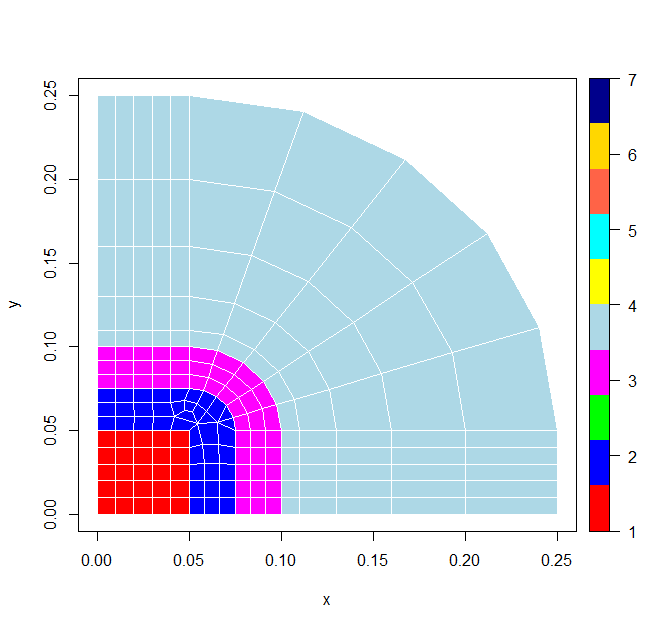
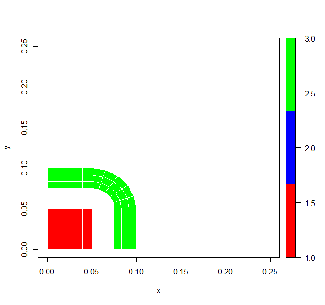
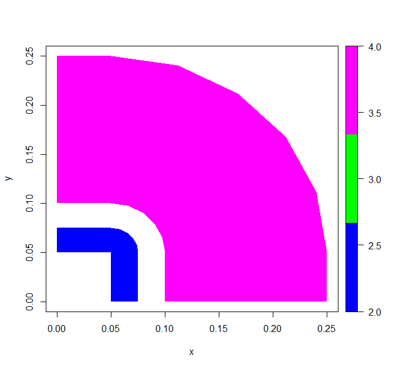
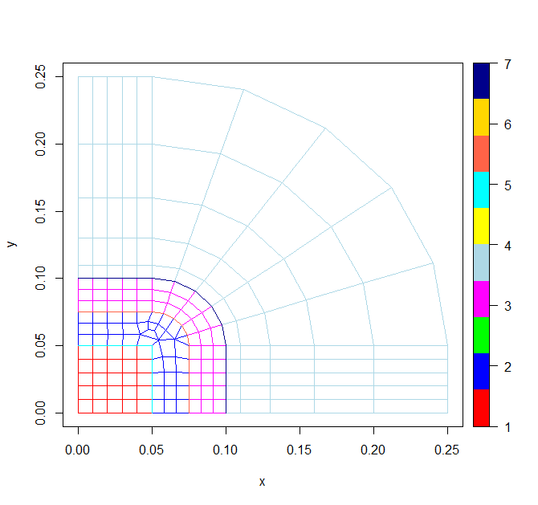

# mesh2D

[](https://travis-ci.com/gabrielpreda/mesh2D)
[](https://codecov.io/github/gabrielpreda/mesh2D) 

Parse a 2D mesh file and plot the data

## Getting Started

Mesh files are used in FEM solutions for PDE problems to describe the geometry of the problem and the materials.

This package is used to parse a 2D mesh file in ATLAS format and plot the 2D mesh using a *plot3D* function, *polygon2D*. The function readMeshFileATLAS is loading a mesh data file in ATLAS format. Then use plotMesh to plot the data (elements and nodes) composing the mesh.

This package is using R6 (object oriented R allowing easy manipulation of nodes and elements in the data structure).

### Prerequisites

To install this project you will need RStudio (version 1.0.1 or above recommended) and R (version 3.4 or above recommended). Also, you will need to install *plot3D* package

```
install.packages("plot3D")
```

### Installing

Installation of the project is straightforward using RStudio. Alternativelly, after you build the package archive using RStudio, you can also install the package with the regular R command

````
install.packages("mesh2D")
````

Alternativelly, one can install the package directly from R Console, and without prior download of the package using the command


````
library(devtools)
install_github("gabrielpreda/mesh2D")
````


## Running the tests

To run the tests, you can load the project in RStudio and select *Build*/*Test Package* command from the menu.

## Example of usage

The package includes a data file *data/pre_geom2D.atl*. This data file is used in the test package as well. To test the package functionality with this data file and inspect the resulted plot, here is a code snapshot to be used.


### Read a mesh file

````
#read the data file and populate a mesh object 'dat'
dat <- mesh2D::readMeshFileATLAS("data/pre_geom2D.atl")
````

### Dislay a mesh 

#### Plot the mesh data (default usage).

````
#plot the mesh in a 2D polygon plot
plotMesh(dat)

````

The following image will be diplayed.




#### Plot the mesh data, with options.

````
#plot the mesh in a 2D polygon plot
plotMesh(dat, domains, showEdges=TRUE, showElem=TRUE)
````


The following parameters are given:  

* dat - mesh data;  
* domains - list of material domains to be plot; if not specified, all the domains will be shown;  
* showEdges - default is `TRUE` i.e. the edges of the elements will be shown;  
* showElem - default is `TRUE` i.e. the solid  elements will be shown; a combination of showEdges = `FALSE` and showElem = `FALSE` will
display only a wireframe for the elements in the shown material domains;  

Few examples:  

```` 
# display only material domains 1 and 3 (coil and iron core)
plotMesh(dat, c(1,3))
````

The result will be the following mesh displayed.

  


```` 
# display material domains 2 and 4 (air only) without edges
plotMesh(dat, c(2,4), showEdges=FALSE)
````

The result will be the following mesh displayed.

  


```` 
# display only wireframes
plotMesh(dat, showEdges=FALSE, showElem=FALSE)
````

The result will be the following mesh displayed.

  


## Authors

* **Gabriel Preda** - *Initial work* - [mesh2D](https://github.com/gabrielpreda/mesh2D)

## License

This project is licensed under the Apache License 2.0


